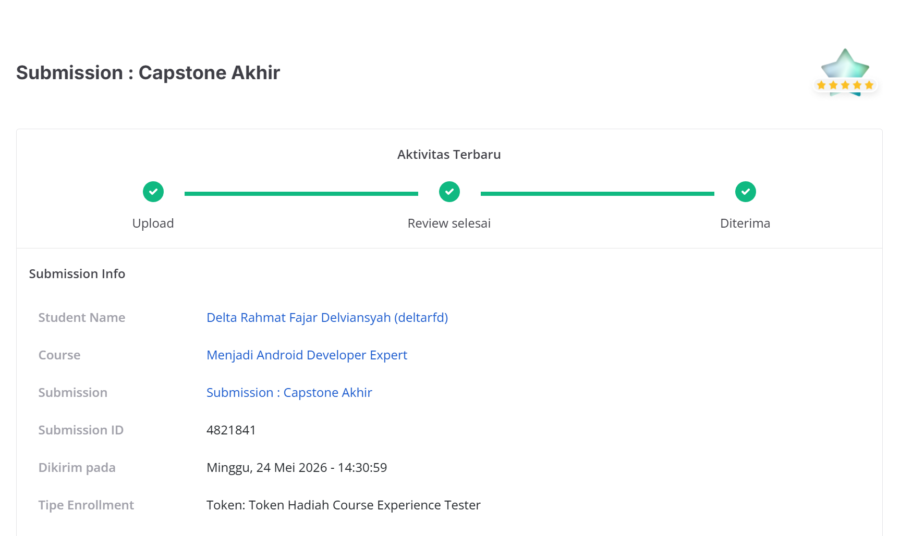
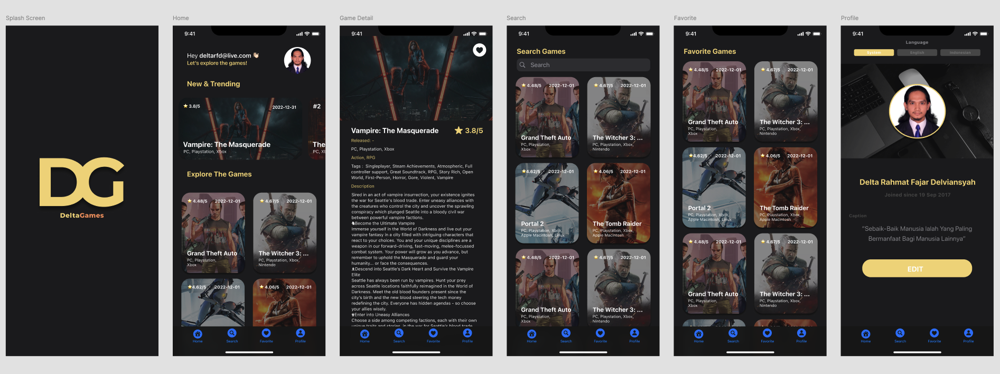
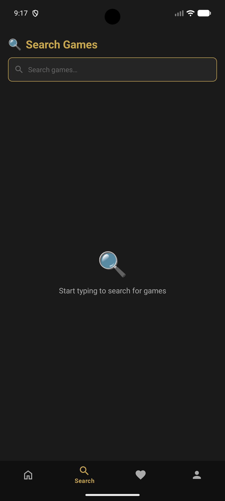
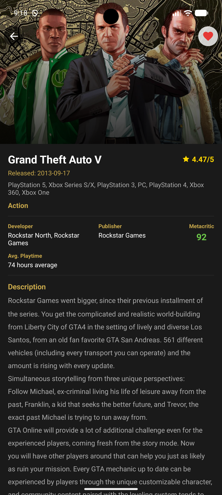
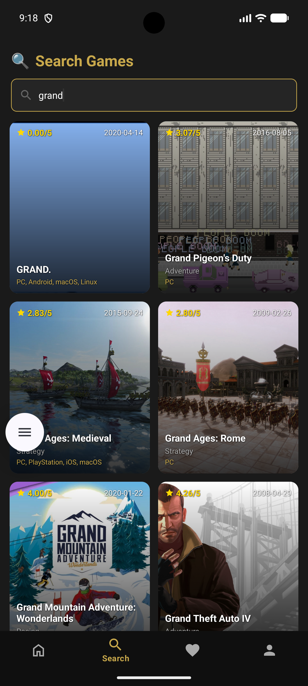
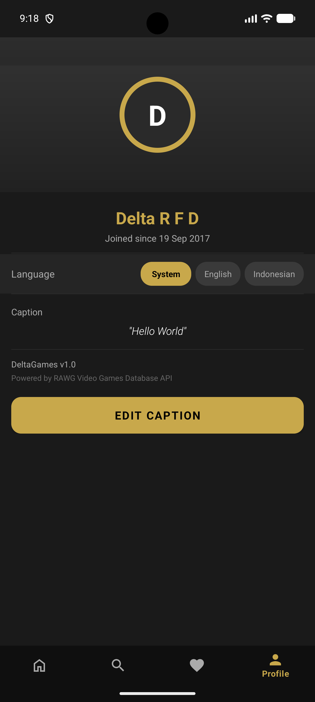

# DeltaGames Android

[](https://github.com/deltarfd/DeltaGamesAndroid/actions/workflows/ci.yml)
[](https://codecov.io/github/deltarfd/DeltaGamesAndroid)

DeltaGames is a modern Android game discovery application built with Kotlin and powered by the RAWG API. This repository showcases clean architecture with multi-module structure, clear separation between presentation, domain, and data layers, plus a dynamic feature module for Favorites. It is designed as both a production-ready app foundation and a learning reference for scalable Android development, including unit tests, CI automation, code coverage, and comprehensive security implementation.

## Submission Result



## Course Certificate

- https://www.dicoding.com/certificates/72ZDJDO86ZYW

## Prototype

[](https://www.figma.com/design/NnC0lsVvTqmuX5Ikvbmuor/Delta-Games---DICODING-2026-Updated?node-id=0-1&t=HlXVOVsqxpOlRHch-1)

[View Wireframe Design](https://www.figma.com/design/NnC0lsVvTqmuX5Ikvbmuor/Delta-Games---DICODING-2026-Updated?node-id=0-1&t=HlXVOVsqxpOlRHch-1)



## Screenshots

<table>
  <tr>
    <td align="center" width="50%"><br/><sub>Home</sub></td>
    <td align="center" width="50%"><br/><sub>Search</sub></td>
  </tr>
  <tr>
    <td align="center"><br/><sub>Detail</sub></td>
    <td align="center"><br/><sub>Favorite</sub></td>
  </tr>
  <tr>
    <td align="center"><br/><sub>Search Result</sub></td>
    <td align="center"><br/><sub>Profile</sub></td>
  </tr>
</table>

## App Overview

- Discover games from the RAWG API with a fast, clean Material Design experience.
- Browse trending and popular games on the Home page with infinite scroll pagination.
- Search titles by keyword with debounced input.
- Open a detail page with collapsing toolbar to see game information.
- Save favorites for quick access later (persisted with encrypted database).
- Switch between English and Indonesian languages in the Profile page.

## Tech Stack

| Layer | Technology |
|-------|-----------|
| Language | Kotlin |
| Architecture | Clean Architecture + MVVM |
| DI | Koin |
| Networking | Retrofit + OkHttp |
| Database | Room + SQLCipher (AES-256 encryption) |
| Key Management | Android Keystore (hardware-backed) |
| Image Loading | Glide |
| Navigation | Jetpack Navigation + Dynamic Feature |
| CI/CD | GitHub Actions + Codemagic |
| Testing | JUnit + MockK + Turbine + Robolectric |
| Coverage | Jacoco + Codecov |
| Leak Detection | LeakCanary |
| Obfuscation | R8/ProGuard |

## Security

| Feature | Implementation |
|---------|---------------|
| Database Encryption | SQLCipher with AES-256, passphrase stored via Android Keystore |
| Certificate Pinning | OkHttp CertificatePinner with SHA-256 pins on `api.rawg.io` |
| Obfuscation | R8/ProGuard with `isMinifyEnabled = true` on all build types |
| Key Management | Hardware-backed Android Keystore (TEE/StrongBox) |

## API Key Configuration

The RAWG API key is managed securely through `local.properties`:

- **For CI/CD**: Set `RAWG_API_KEY` secret in GitHub Actions or Codemagic environment variables.
- **For Local Development**: Add `RAWG_API_KEY=your_key_here` to `local.properties` (gitignored).

## Build Locally

### 1) Configure API key

```properties
# local.properties
RAWG_API_KEY=your_rawg_api_key
```

### 2) Build debug APK

```bash
./gradlew assembleDebug
```

### 3) Run unit tests

```bash
./gradlew testDebugUnitTest
```

### 4) Generate coverage report

```bash
./gradlew jacocoTestReport
```

## Repository Structure

- `app/` — Main application module (Activities, Fragments, ViewModels, Adapters).
- `core/` — Core library module (data layer, domain layer, DI, security utilities).
- `favorite/` — Dynamic feature module for the Favorites screen.
- `.github/workflows/` — GitHub Actions CI pipeline.
- `codemagic.yaml` — Codemagic build pipeline.
